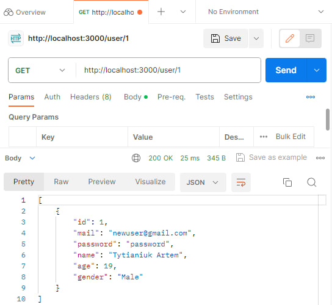

# Тестування працездатності системи

## Старт системи

## Створення користувача

## Отримання користувача за його id

## Створення користувача без параметра "gender"

## Отримання користувача  без параметра "gender" за його id

## Отримання всіх користувачів

## Видалення користувача

## Отримання користувачів, які залишилися

## Оновлення користувача повністю

## Часткове оновлення користувача

## Видалення всіх користувачів

